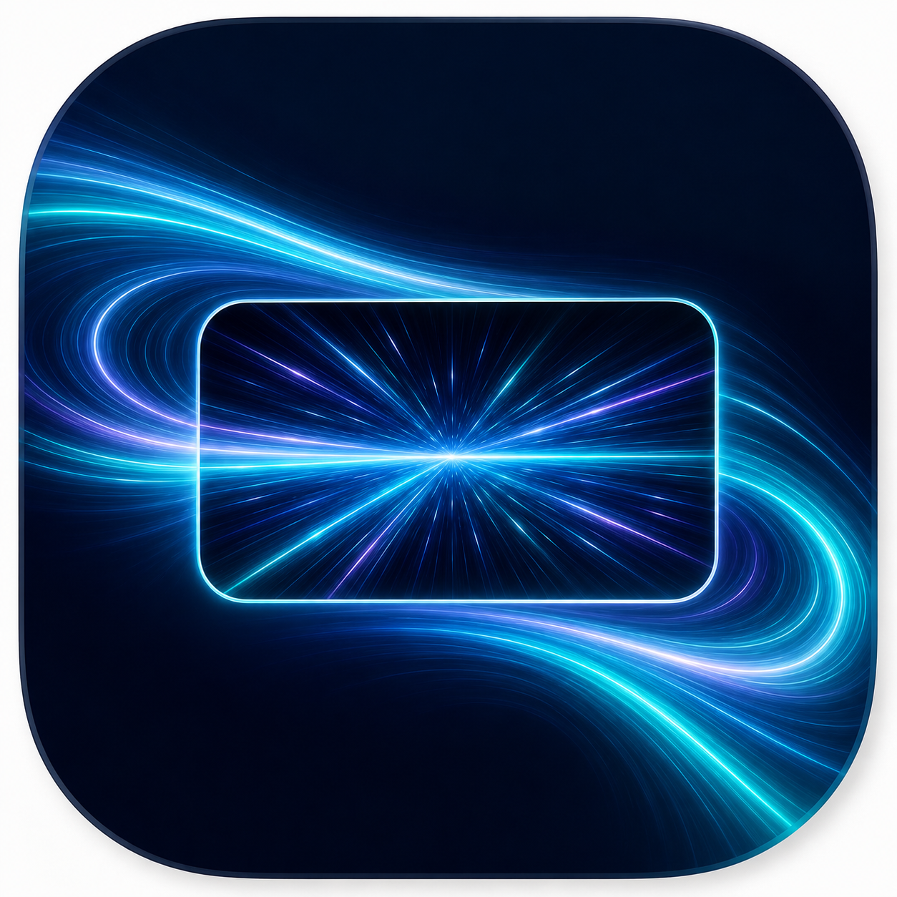
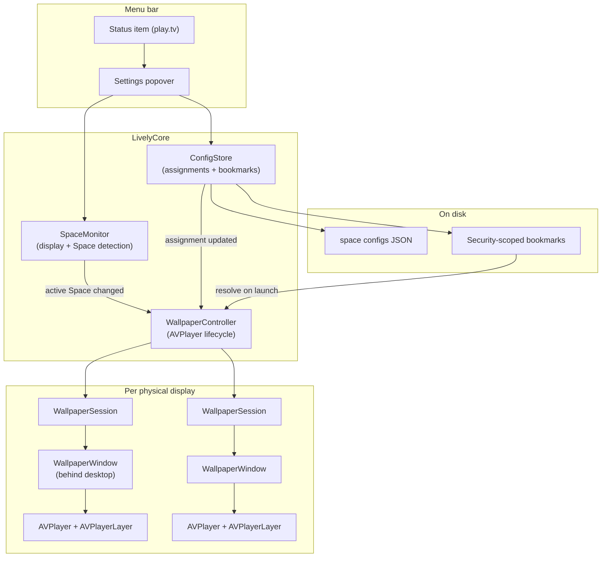

<p align="center">
  
</p>

# Lively

[](LICENSE)
[](https://www.apple.com/macos/)
[](https://swift.org)
[](https://github.com/harshabala/Lively/releases)

**Video wallpapers for every Space on your Mac.**

Lively is a native macOS menu-bar utility that plays looping, hardware-accelerated video behind your desktop — independently on each display and each Space. Switch to your focus Space and one clip is playing; swipe to your music Space and another is already looping. No Dock icon, no browser wrapper, no cloud account. Just your wallpaper, quietly doing its job.

---

## 🙋 For Users
- [Download & install](#download--install)
- [How to use](#how-to-use)
- [Features](#features)
- [Limitations](#limitations)

## 👩‍💻 For Developers
- [Building](#building)
- [Architecture](#architecture)
- [Entitlements and sandboxing](#entitlements-and-sandboxing)

---

## Download & install

**Latest release: [v1.2.0](https://github.com/harshabala/Lively/releases/latest)** · [All releases](https://github.com/harshabala/Lively/releases)

### Option 1 — Download zip (recommended)

1. Download **`Lively-1.2.0-macOS.zip`** from [GitHub Releases](https://github.com/harshabala/Lively/releases/latest)
2. Unzip and drag **`Lively.app`** to **Applications**
3. Clear macOS download quarantine (required once — see below)
4. Open Lively — look for the **play.tv** icon in the menu bar

### Option 2 — Homebrew

```bash
brew tap harshabala/lively https://github.com/harshabala/Lively
brew install --cask lively
```

Homebrew installs to `/Applications/Lively.app` and clears quarantine automatically. If macOS still blocks launch, run the command in the next section.

### First launch: Gatekeeper (no Apple Developer ID)

Lively is **ad-hoc signed**, not notarized. macOS marks downloads from the internet with a **quarantine flag** and may refuse to open apps from unidentified developers.

**Run this once in Terminal after installing:**

```bash
xattr -dr com.apple.quarantine /Applications/Lively.app
```

| | |
|---|---|
| **What it does** | Removes the `com.apple.quarantine` attribute macOS adds to downloaded files |
| **Why it's needed** | Without an Apple Developer ID, Lively cannot be notarized. Clearing quarantine tells macOS you trust this download |
| **Is it safe?** | Only run this on `Lively.app` you downloaded from [this repository's Releases](https://github.com/harshabala/Lively/releases) |

Then open the app:

```bash
open /Applications/Lively.app
```

If macOS still warns you, **right-click → Open** on `Lively.app` once and confirm.

### Option 3 — Build from source (developers)

Requires **Xcode 15+**. See [Building](#building) below.

---

## Overview

Most video-wallpaper apps on macOS are Electron shells or web renderers duct-taped to the desktop. Lively is different: a **100% native Swift app** built on Apple frameworks with **zero third-party dependencies**. Video decode, window layering, Space detection, preferences, and persistence all run through AVFoundation, AppKit, SwiftUI, and ServiceManagement.

| | |
|---|---|
| **Platform** | macOS 14.0 (Sonoma) or later |
| **Distribution** | [GitHub Releases](https://github.com/harshabala/Lively/releases) zip or Homebrew cask |
| **Privacy** | Fully offline — no analytics, telemetry, or network entitlement |
| **Codecs** | H.264 and HEVC only (hardware-decoded) |
| **License** | [MIT](LICENSE) — free to use, modify, and distribute |

---

## How it works

Lively sits in the menu bar as a background (`accessory`) process. When you assign a video, it opens a special `WallpaperWindow` on each physical display, draws an `AVPlayerLayer` behind the desktop icons, and keeps playback in sync as you change Spaces or connect monitors.



### Per-Space assignments

macOS Spaces are identified by a composite key: **display ID + desktop wallpaper URL**. That means the same physical monitor can have different Lively videos on different Spaces — and they play simultaneously without interfering with each other.

### Persistence model

When you pick a video, Lively stores a **security-scoped bookmark** (not a raw file path). On relaunch it re-opens only the files you explicitly chose — no broad filesystem access, no re-prompting every session.

---

## How to use

### 1. Install and launch

```bash
# Build and run (development)
swift run LivelyApp

# Or package a signed .app bundle
./package.sh
open /private/tmp/LivelyOutput/Lively.app
```

After launch, look for the **play.tv** icon in the menu bar. Lively does not appear in the Dock.

### 2. Assign a wallpaper

1. Click the menu-bar icon to open **Settings**.
2. On the **Displays** tab, find your monitor card.
3. Choose a mode:
   - **Wallpaper** — one video for the current Space.
   - **Light & Dark** — separate videos for macOS light and dark appearance.
4. **Drop** an `.mp4`, `.mov`, or `.m4v` onto the drop zone, or **click** to browse.
5. Lively validates the codec (H.264 / HEVC only) before accepting the file.

### 3. Adjust playback

Each assigned display card exposes:

- **Scale** — Fill (crop to screen) or Fit (letterbox).
- **Mute / volume** — audio plays from the wallpaper layer (useful for ambient loops).
- **Remove** — clears the assignment for that Space.

Use the **pause/play** button in the settings header to pause all wallpapers globally.

### 4. Preferences

On the **Settings** tab:

- **Launch at Login** — registers via `SMAppService` (macOS 13+).
- **Reset All Data** — clears all assignments and preferences.
- **Logs** — view and copy in-app logs for troubleshooting.
- **About** — version, supported formats, release link.

### 5. Switch Spaces

Swipe between Spaces (or use Control+Arrow). Lively detects the active Space per display and swaps to the correct video automatically. Assignments you made on other Spaces resume when you return.

---

## Features

- **Per-Space, per-display wallpapers** — independent playback on every monitor and Space
- **Hardware-accelerated 4K** — H.264 and HEVC decoded on the dedicated video engine (near-zero CPU on Apple Silicon)
- **Codec validation at assignment** — VP9, AV1, and other codecs are rejected with a clear error instead of a black screen
- **Light / Dark appearance mode** — different videos for each macOS appearance on the same Space
- **Security-scoped bookmarks** — assignments survive reboots without re-selecting files
- **Launch at Login** — modern `SMAppService` registration, no LaunchAgents plist
- **Menu-bar-first UX** — compact 480×560 settings panel; wallpaper stays the hero
- **Fully offline** — no network entitlement, no analytics, no telemetry
- **Accessible UI** — Reduce Motion support, VoiceOver labels, 32pt hit targets, error announcements
- **In-app logging** — `os.Logger` wrapper with copy-to-clipboard viewer
- **Native motion design** — pill tabs, staggered card entrance, symbol cross-fades (all gated on Reduce Motion)

---

## Limitations

| Area | What Lively does *not* do (today) |
|------|-----------------------------------|
| **Codecs** | Only **H.264** and **HEVC**. VP9, AV1, ProRes, and others are rejected. Re-encode with ffmpeg if needed. |
| **Containers** | `.mp4`, `.mov`, `.m4v` only. |
| **Sandbox / App Store** | Runs **unsandboxed**. Drawing behind all windows and managing Spaces requires capabilities the App Sandbox does not currently allow. Mac App Store distribution would need a sandbox rethink. |
| **Notarization** | `package.sh` performs ad-hoc signing for local use. Production distribution requires Apple Developer signing and notarization. |
| **Single wallpaper per Space** | One video (or light/dark pair) per display+Space — no playlists, schedules, or random rotation. |
| **No GIF / image wallpapers** | Video only. Static images are handled by macOS itself. |
| **Audio** | Wallpaper audio plays from the desktop layer; macOS may mix it with other app audio. No per-app ducking. |
| **Multi-user / iCloud sync** | Config is local to the machine. No sync across Macs. |
| **Update checker** | No in-app auto-update. Check [GitHub Releases](https://github.com/harshabala/Lively/releases) manually. |
| **Intel performance** | 4K HEVC depends on hardware decode (T1/T2 Macs and Apple Silicon). Older Intel GPUs may struggle with very high bitrates. |
| **File size** | No hard cap — AVFoundation streams from disk — but extreme bitrates can stutter if SSD throughput is the bottleneck. |

### Re-encoding unsupported videos

```bash
# Example: convert a VP9 download to HEVC
F=$(find ~/Downloads -name "*.mp4" | head -1)
ffmpeg -i "$F" -c:v libx265 -crf 24 -preset fast -an output_hevc.mp4
```

---

## Supported formats

| Codec | Containers | Notes |
|-------|-----------|-------|
| H.264 (AVC) | MP4, MOV, M4V | Hardware-decoded on all supported Macs |
| HEVC (H.265) | MP4, MOV, M4V | Hardware-decoded on Apple Silicon and most T1/T2 Intel Macs |

---

## Requirements

- macOS 14.0 (Sonoma) or later
- **Xcode 15+** with Swift 6.2 (full Xcode required — Command Line Tools alone cannot build SwiftUI)
- Apple Silicon or Intel Mac

---

## Building

```bash
# Debug build
swift build

# Release build
swift build -c release

# Run tests
./test.sh

# Run directly
swift run LivelyApp
```

> **Note:** Lively uses SwiftUI macros (`@State`, `@Observable`) that require the SwiftUI macro plugin shipped with **full Xcode**. If `swift build` fails with `SwiftUIMacros not found`, install Xcode from the App Store and run `sudo xcode-select -s /Applications/Xcode.app/Contents/Developer`. For tests, `test.sh` adds the required rpath flags when using Command Line Tools.

### Package a signed `.app` bundle

```bash
./package.sh
open /private/tmp/LivelyOutput/Lively.app
```

`package.sh` builds release, assembles `Lively.app` (default: `/private/tmp/LivelyOutput/`), copies `AppIcon.icns`, writes `Info.plist`, and ad-hoc signs with `entitlements.plist` so Launch at Login works locally. Override output with `LIVELY_OUTPUT_DIR=`.

---

## Architecture

```
Sources/
  Lively/                    — LivelyCore library (testable)
    Core/
      WallpaperController    — AVPlayer lifecycle, pause/resume, Space sync
      WallpaperWindow        — NSWindow behind the desktop layer
    Logic/
      ConfigStore            — Preferences + security-scoped bookmarks
      DynamicWallpaper       — Per-Space assignment model
      SpaceMonitor           — Display and active Space detection
      LivelyLogger           — os.Logger wrapper + LogStore
    UI/
      SettingsContainerView  — Main panel with tab navigation
      DisplaysView           — Per-display Space cards
      ScreenCardView         — Drop zone, mode picker, thumbnail, volume
      PreferencesView        — Launch at Login, reset, logs, about
      LivelyBrand            — Design tokens (Mist Reef palette)
  LivelyApp/
    main.swift               — AppDelegate, menu bar, popover
Tests/
  LivelyTests/               — ConfigStore, codec validation tests
```

Design docs: [`brand.md`](brand.md) · [`PRODUCT.md`](PRODUCT.md) · [`DESIGN.md`](DESIGN.md)

---

## Entitlements and sandboxing

Lively runs **unsandboxed**. Drawing video behind all windows requires capabilities the macOS App Sandbox does not currently permit.

| Entitlement | Purpose |
|-------------|---------|
| `com.apple.security.files.user-selected.read-only` | Read user-chosen video files |
| `com.apple.security.files.bookmarks.app-scope` | Re-open videos after relaunch |

No network, camera, microphone, or location entitlement is present.

---

## Logging and privacy

Logging uses `os.Logger` via `LivelyLogger`, organised by subsystem (`com.lively.app`). View logs in-app (Settings → Logs) or in Console.app filtered by subsystem. File paths in logs use `lastPathComponent` only.

The app performs **no network requests** and collects **no user data**.

---

## Local verification

```bash
./scripts/smoke_verify.sh
open /private/tmp/LivelyOutput/Lively.app
```

Manual checks:

- Menu bar icon appears
- Settings opens from the menu bar
- Dropping or selecting `.mp4`, `.mov`, or `.m4v` assigns a wallpaper
- Pause/Resume updates playback state
- Quit and relaunch — persisted assignments reload correctly
- Switch Spaces — correct video resumes per Space

---

## Attributions

Lively uses **no third-party libraries**. Built entirely on Apple frameworks:

| Framework | Used for |
|-----------|---------|
| AVFoundation | Playback, codec inspection (`CMFormatDescription`) |
| CoreGraphics | Display enumeration |
| SwiftUI / AppKit | UI, `NSWindow`, `NSStatusItem` |
| ServiceManagement | `SMAppService` Launch at Login |
| os.Logger | Structured logging |

---

## License

Lively is released under the **[MIT License](LICENSE)**.

You are free to use, copy, modify, merge, publish, distribute, sublicense, and/or sell copies of the software, subject to the license terms. The software is provided "as is", without warranty of any kind.

---

## Contributing

Contributions are welcome. Open an issue to discuss bugs or feature ideas, or submit a pull request.

1. Fork the repository
2. Create a feature branch (`git checkout -b feature/my-change`)
3. Run `./test.sh` before opening a PR
4. Open a pull request against `master`

See [CHANGELOG.md](CHANGELOG.md) for release history.

---

## Developer

Built by **[@harshabala](https://github.com/harshabala)**.

Designed and shipped with AI-assisted development workflows.

Questions or ideas → **[github.com/harshabala/Lively/issues](https://github.com/harshabala/Lively/issues)**

---

*Copyright © 2026 Harsha Balakrishnan. Licensed under MIT.*