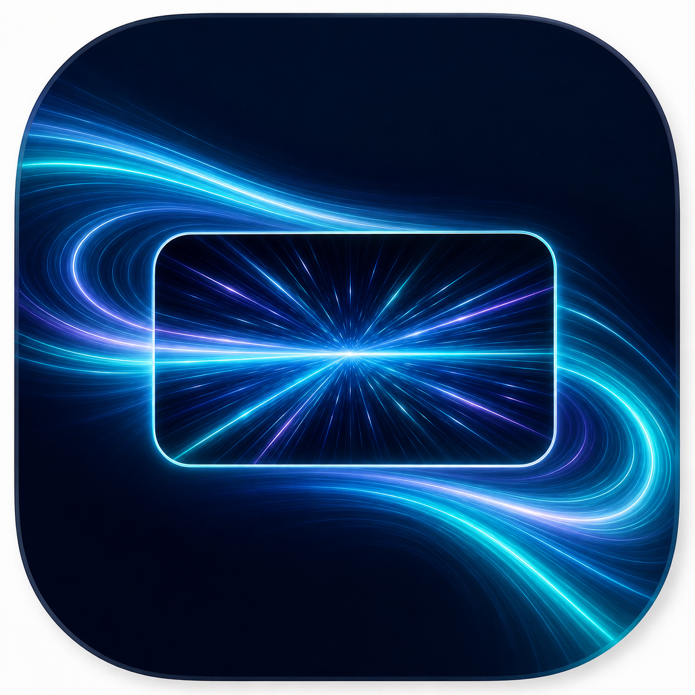

<p align="center">
  
</p>

# Lively

[](LICENSE)
[](https://www.apple.com/macos/)
[](https://github.com/harshabala/Lively/releases)

**Video wallpapers for your Mac.**

Lively is a small menu bar app. It plays looping video behind your desktop icons. Each display and each Space can have its own clip. No Dock icon. No account. No cloud.

## Install

1. Download the latest **DMG** or **zip** from [Releases](https://github.com/harshabala/Lively/releases/latest).
2. Drag **Lively.app** into **Applications**.
3. Open Lively. Look for it in the **menu bar** (top right).

### If macOS blocks the app

Lively is signed for local use, not notarized by Apple. After install, run once:

```bash
xattr -dr com.apple.quarantine /Applications/Lively.app
```

Or right-click **Lively.app** → **Open** → confirm.

### Homebrew

```bash
brew tap harshabala/lively https://github.com/harshabala/Lively
brew install --cask lively
```

## How to use

1. Click the menu bar icon.
2. On **Displays**, pick a display card.
3. Drop an **MP4**, **MOV**, or **M4V** on the zone (or click to browse).
4. Only **H.264** and **HEVC** work. Other codecs, and damaged or incomplete files, are rejected with a clear error (on display cards and in the Library).

### Modes

- **Wallpaper** — one video for that Space
- **Light & Dark** — different videos for light and dark appearance

### Library

Save videos once. Apply them to one display or all displays.

### Settings

- Launch at login
- Pause on battery
- Playback quality and loop
- Appearance (light / dark / system)
- Reset data
- Logs and About (includes first-launch help)

Pause and resume all wallpapers from the top of the window.

Lively also stops decoding on its own when nobody can see the video: while the displays or the Mac sleep, the screen is locked, the screen saver runs, you switch to another user, or a display's wallpaper is fully covered by a full-screen or maximised window. It resumes automatically.

If a video goes missing (moved, deleted, or on an ejected drive), that display shows your normal macOS wallpaper and the card offers **Reselect**. Moved or renamed files are usually followed automatically; a re-inserted drive is picked up when it mounts.

## What it is

| | |
|---|---|
| Platform | macOS 14+ |
| Stack | Native Swift. No third-party libraries. |
| Privacy | Offline by default. Optional GitHub update check only if you turn it on. |
| License | [MIT](LICENSE) |

## Limits

- **Codecs:** H.264 and HEVC only
- **Files:** `.mp4`, `.mov`, `.m4v`
- **Not App Store:** needs desktop-layer access the sandbox does not allow
- **Not notarized:** clear quarantine once after download (see Install)
- **Spaces** are told apart by their macOS desktop picture. Two Spaces on the same display with the same desktop picture share one clip.
- **No playlists or schedules** yet
- **Updates:** banner can open Releases; no auto-install

## Build from source

```bash
./package.sh
open /private/tmp/LivelyOutput/Lively.app
```

DMG with drag-to-Applications:

```bash
./scripts/make-dmg.sh
```

Needs Xcode or Command Line Tools.

## Privacy

Assignments stay on your Mac. Security-scoped bookmarks remember the files you chose. No analytics. Lively makes no network requests unless you turn on **Check for Updates** (off by default), which asks the GitHub Releases API for the latest version at launch. Note: Lively is not sandboxed (it has to draw below the desktop icons), so this is a promise kept by the code rather than enforced by an entitlement.

## License

MIT. See [LICENSE](LICENSE).
